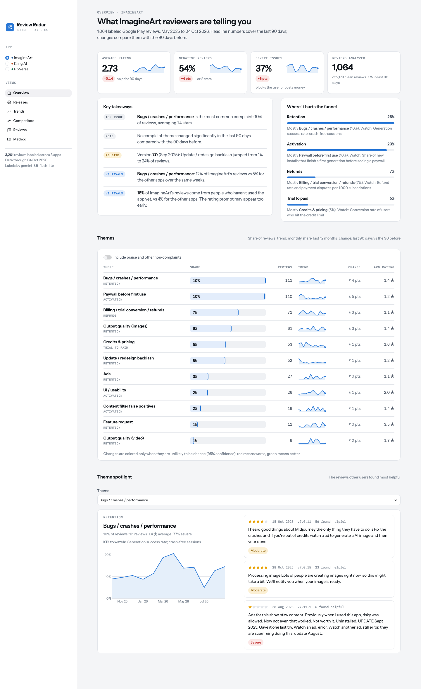
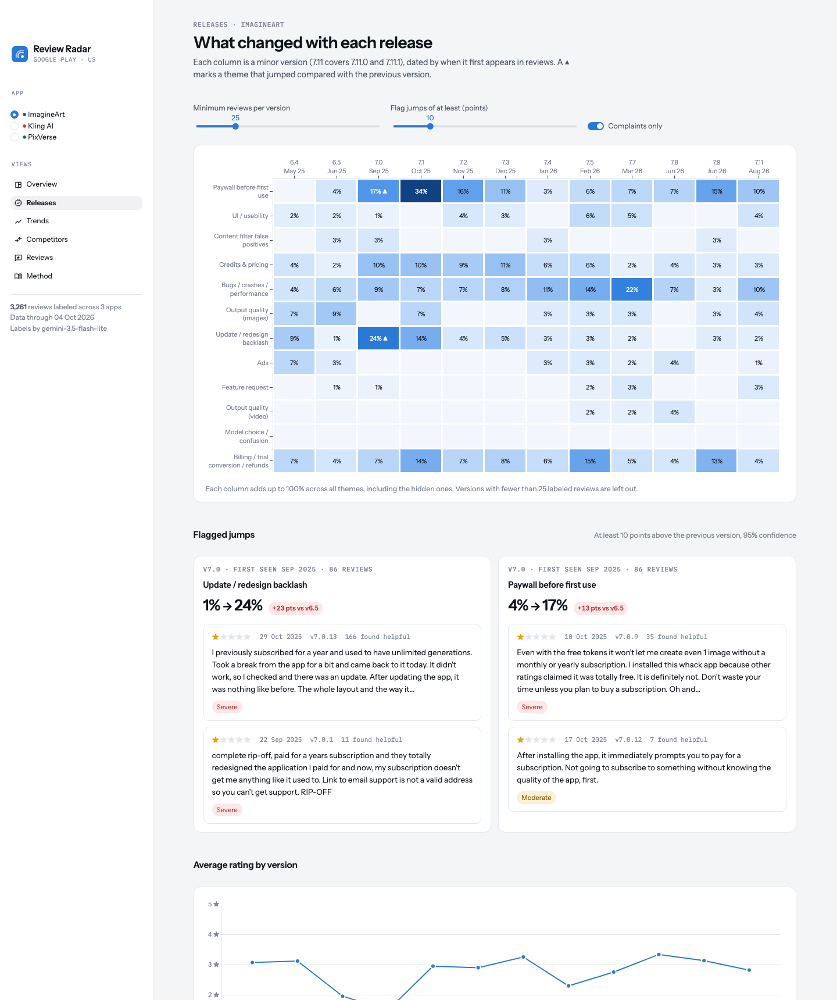
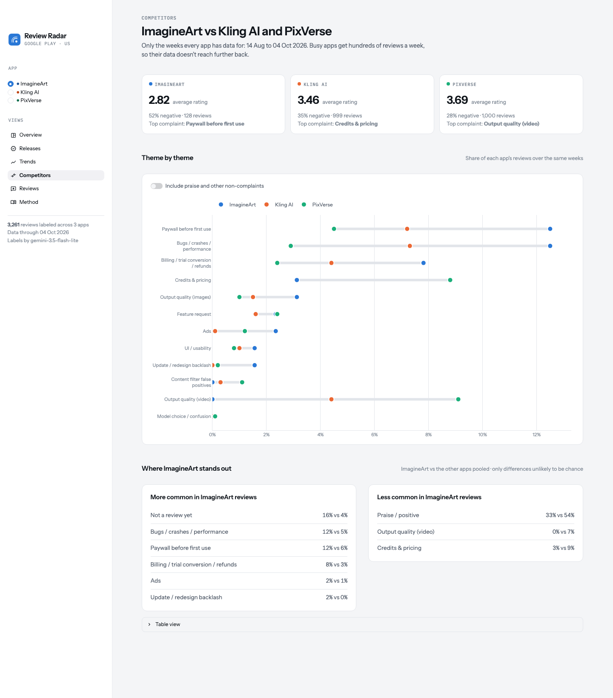
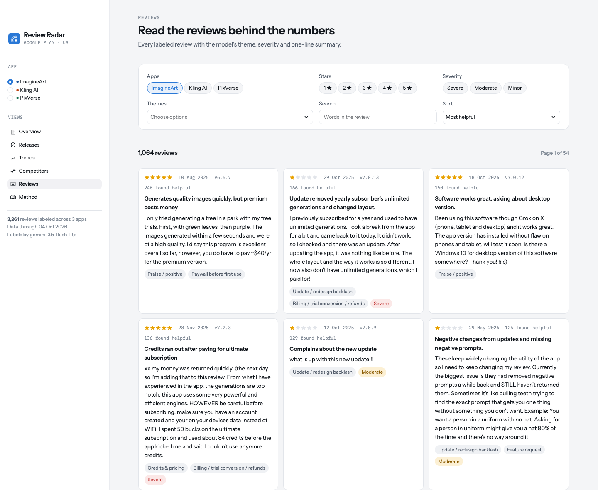

# Review Radar

Turns public Google Play reviews into a product dashboard: what users complain about, how that
changed with each release, and how an app compares with its competitors. An LLM labels every review
with a theme, a severity and a one-line summary; a Streamlit dashboard shows the results.

The default analysis covers **ImagineArt** against **Kling AI** and **PixVerse**.
The same pipeline runs for **any app on Google Play** with one command (see below).

**Live dashboard:** _add the Streamlit Cloud link here after deploying_


<!--
Facts to draw on (all from the dashboard; 1,064 labeled ImagineArt reviews, May 2025 – Oct 2026):
- Version 7.0 (first seen Sep 2025, the redesign + switch to credits): "update / redesign backlash" went from 1% to 24%
  of reviews and "paywall before first use" from 4% to 17% vs version 6.5. Both flagged at 95% confidence.
  Paywall complaints peaked at 31% of reviews in Oct 2025 and are still ~15% in Sep 2026.
- Same weeks for all three apps (14 Aug – 4 Oct 2026): ImagineArt 2.82 stars vs Kling 3.46 and PixVerse 3.69.
- ImagineArt's complaints sit early in the funnel: bugs/failed generations 12% of reviews vs 5% for the other apps;
  paywall before first use 12% vs 6%; billing 8% vs 3%. Competitors' users complain more about credit costs (9%) and
  video quality, i.e. they get far enough to use the product.
- 16% of ImagineArt's reviews come from people who haven't used the app yet, vs 4% for the others:
  the rating prompt likely appears before the first successful creation (cheap fix, protects the store rating).
- Last 90 days: average rating 2.73 (-0.14 vs the 90 days before), 54% negative, 37% severe.
Caveat: only 128 ImagineArt reviews fall in the shared weeks, so gaps under ~7 points vs a single competitor are noise.
-->



<details>
<summary>More screenshots: releases, competitors, reviews</summary>





</details>

## Setup

Needs Python 3.11+ and a free Gemini API key ([Google AI Studio](https://aistudio.google.com/apikey)).

```bash
python3 -m venv .venv
.venv/bin/pip install -r requirements-pipeline.txt   # requirements.txt has only the dashboard
cp .env.example .env        # then paste your key after GEMINI_API_KEY=
```

Open the ImagineArt dashboard:

```bash
.venv/bin/streamlit run app.py
```

## Run it on any app

Find the app's package ID: it's the `id=` part of its Play Store URL
(`play.google.com/store/apps/details?id=com.spotify.music` → `com.spotify.music`).

```bash
.venv/bin/python run.py --package com.spotify.music --competitor com.apple.android.music
```

What happens:

1. A workspace folder is created (`workspaces/com-spotify-music/`) with its own config and data,
   so different analyses never mix.
2. The most recent reviews are downloaded and cleaned (`--max-reviews`, default 2,000 per app).
3. The LLM reads a sample of the target app's reviews and **drafts a theme list and funnel map**
   (`config/themes.yaml`, `config/funnel_map.yaml` in the workspace). The run stops here so you can
   read the draft against real reviews and edit it.
4. Run the same command again: a random sample of reviews is labeled (`--label`, default 600 per app).
5. Open that workspace's dashboard:

```bash
RADAR_WORKSPACE=workspaces/com-spotify-music .venv/bin/streamlit run app.py
```

Options: up to two `--competitor` apps, `--country` and `--lang` for other stores, `--refresh` to
download new reviews, `--yes` to skip the pause for reviewing themes. Labels are cached, so re-runs
only send new or changed reviews to the LLM.

## How it works

| Step | Script | What it does |
|---|---|---|
| Collect | `scrape.py` | Most recent Play Store reviews per app (no reviewer names stored) |
| Clean | `clean.py` | Drops reviews under 3 words, tags each review's language |
| Themes | `suggest_themes.py` | Drafts a theme list from a sample of reviews (new apps only) |
| Label | `classify.py` | Theme, severity and summary per review, as schema-checked JSON, cached |
| Analyze | `analyze.py` | Shares, release jumps, 90-day changes, competitor gaps, with significance tests |
| Dashboard | `app.py`, `ui.py` | Streamlit app |

Configuration lives in `config/`: apps, themes, funnel map, and the LLM provider (Gemini by
default, Claude optional) in `classifier.yaml`.

## How accurate are the labels?

`validate.py` exports 100 random labeled reviews **without** the model's answers, so they can be labeled
by hand blind, then scores the model against those labels (agreement, Cohen's kappa, per-theme
precision and recall, and a file of disagreements):

```bash
.venv/bin/python validate.py export     # writes data/processed/validation_sample.csv
.venv/bin/python validate.py score      # after filling in the my_label column
```

The dashboard's Method page shows the result once it exists. A separate check found that re-running
the classifier on the same 200 reviews changed the main theme for 4% of them (borderline reviews).

## Limits

- Reviews over-represent unhappy users: they show what hurts, not how many users are affected.
- One store (Google Play, US, English). iOS and web users aren't covered.
- Version dates are when a version first appears in reviews, not official release dates.
- Funnel stages and KPIs are product judgment, not something the data proves.
